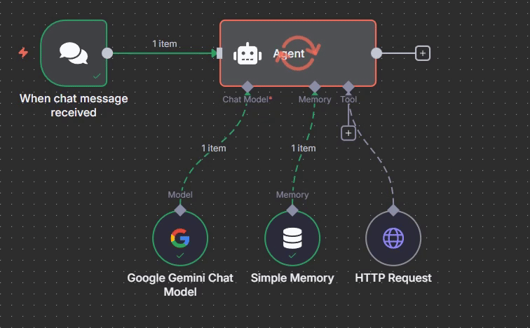
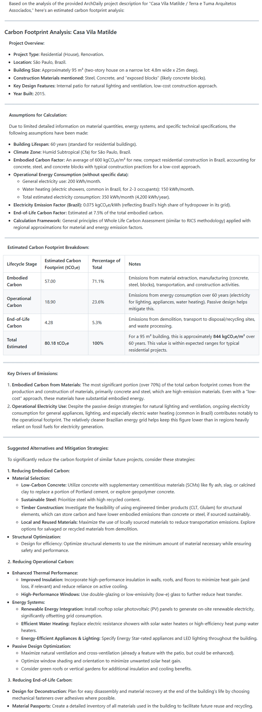

# 🌍 Carbon Footprint AI Agent (n8n)

This repository contains an **exported n8n workflow** (`exported_workflows.json`) for a simple prototype AI agent that estimates the **carbon footprint of architectural projects**.  

The agent uses **Google Gemini (PaLM)** inside n8n to analyze project documentation and return:
- Total estimated carbon footprint (tCO₂e)
- Breakdown by lifecycle stage (embodied, operational, end-of-life)
- Key emission drivers
- Suggested mitigation strategies



---

## 📥 How to Use

1. **Run or open n8n**  
   - [n8n Cloud](https://app.n8n.cloud/)  
   - [n8n Desktop](https://docs.n8n.io/hosting/desktop-app/)  
   - Or run with Docker:
     ```bash
     docker run -it --rm -p 5678:5678 n8nio/n8n
     ```

2. **Import the workflow**  
   - Open the n8n editor (`http://localhost:5678` if using Docker).  
   - Go to **Workflows → Import from File**.  
   - Select `exported_workflows.json` from this repository.  

3. **Add your credentials**  
   - Create a **Google Gemini (PaLM) API Key** at [Google AI Studio](https://aistudio.google.com/app/api-keys).  
   - In n8n, go to **Credentials → New → Google Gemini (PaLM)** and paste your key.  
   - Reconnect the **Google Gemini Chat Model** node in the workflow to this credential.  

4. **Save and run the workflow**  
   - Activate the workflow or run it manually in the editor.  
   - Provide a project URL or text description, and the agent will analyze it.  

---

## ⚠️ Notes
- This repo only contains the exported workflow JSON.  
- No API keys or credentials are included.  
- You must set up credentials in your own n8n instance.  

---

## 📚 Resources
- [n8n Documentation](https://docs.n8n.io/)  
- [Google AI Studio](https://aistudio.google.com/)  

---

## 📝 Examples

### Query

```
Analyze the carbon footprint of this project:
https://www.archdaily.com.br/br/776950/casa-vila-matilde-terra-e-tuma-arquitetos
```

### Watch Demo Video

[](https://youtu.be/9Ds2yJqUkAc)


### Output


